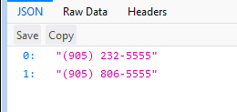
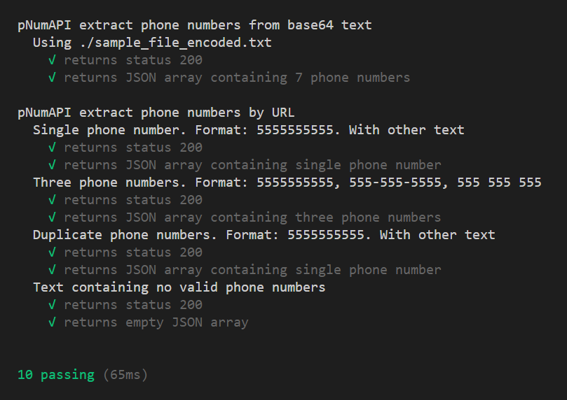

# pNumAPI
A Node.js / Express implementation of Google's libphonenumber

## Introduction
Thank you for finding our project!

This is a web service that runs locally on your machine. It will find potential phone numbers given a variety of different input, validate them using [google-libphonenumber](https://github.com/ruimarinho/google-libphonenumber), and respond with a consistantly formatted JSON list of phone numbers.

Please enjoy use of this software. We hope you may be interested in contributing to bug fixes and enhancements.

This software was written and tested using [Node.js](https://nodejs.org/en/) v8.4.0 and Node Package Manager (npm) v5.3.0. If you do not have Node.js or npm installed, [aquire a copy](https://nodejs.org/en/) prior to further installation.

## Installation
1. Clone this repository
2. Browse to your working folder and use npm to install dependencies:
```sh
npm install
```
3. Start the server by using the following command:
```sh
node server.js
```

By default, this web service utilizes port 8080. Verify that the service is running by checking console output:


## Usage
### Extract Phone Numbers from URL Text
URL format:

    localhost:8080/api/phonenumbers/parse/text/My%20Phone%20Number%20String%3A%20905-491-5050

pNumAPI will inspect a short string of text within the URL, and return a json formatted response containing a list of valid phone numbers found within the string. This method first builds a list of possible phone numbers limited to the following formats:

    (123) 456-7890
    (123)456-7890
    123-456-7890
    123.456.7890
    1234567890
    +31636363634
    075-63546725 

If duplicate phone numbers are found, only one is kept. Each possible phone number is then validated using [google-libphonenumber](https://github.com/ruimarinho/google-libphonenumber). If no valid phone numbers are found, an empty list is returned. All valid results are returned in the following format:

> (905) 491-5050

For example, entering this URL into a web browser:

> localhost:8080/api/phonenumbers/parse/text/Joe:9052325555Joes%20House:905-232-5555Jill:905%20806%205555

Returns the following:



### Extract Phone Numbers from base64 Text
URL format:

    localhost:8080/api/phonenumbers/parse/sample_file_encoded.txt

This POST route will inspect the body element of the request, treat it as base64 text, extract valid phone numbers from it, and return a JSON formatted array of phone numbers. This can be used to process longer strings than a URL allows for. 

One of the provided test cases will read the contents of ./test/sample_file_encoded.txt to the body element of a [request](https://github.com/request/request) module object, and send the POST request to the server.

We hope to implement other examples illustrating this feature in the future.

## Tests
pNumAPI uses [Mocha](https://mochajs.org/) test framework with [Chai](http://chaijs.com/). To run the tests, first start the pNumAPI web service, then in a seperate terminal run the command:
```sh
npm test
```
This should result in the following:



## Dependencies
### Express
To facilitate web service archetecture, the popular Node.js framework [Express](https://expressjs.com/) v4.16.2.

### body-parser
To handle POST requests of content type plan/text and body containing base64 encoded text files, the express middleware [body-parser](https://github.com/expressjs/body-parser)

### google-libphonenumber
Core functionality of this software is made possible by utilizing the Node.js friendly third-party port [google-libphonenumber](https://github.com/ruimarinho/google-libphonenumber) which is a useful wrapper to Google's open source [libphonenumber](https://github.com/googlei18n/libphonenumber) library.

## Licenses
This software is licensed under BSD-2-Clause. The [google-libphonenumber](https://github.com/ruimarinho/google-libphonenumber) package is licensed under MIT. The bundled [libphonenumber](https://github.com/googlei18n/libphonenumber) library is licensed under Apache 2.0.